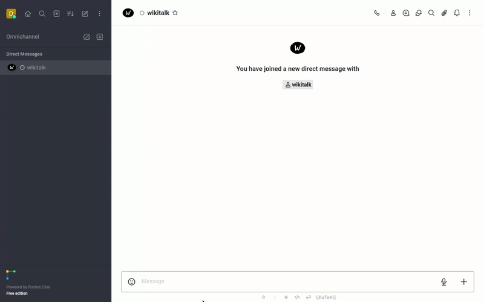
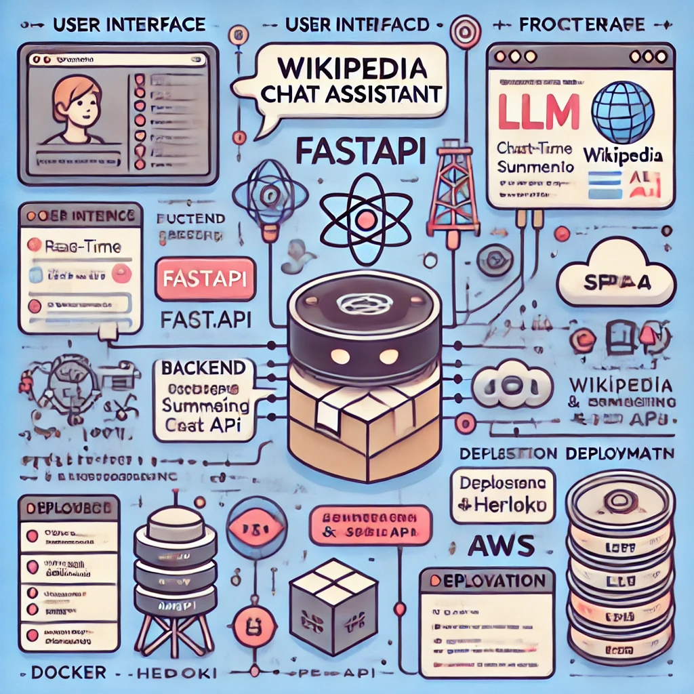

# LLM-Powered-Wikipedia-Chat-Assistant
In this project, we'll explore the integration of retrieval-based augmentation (RAG) to enhance large language model (LLM) applications. Our goal is to develop an LLM-powered conversational assistant with access to Wikipedia, enabling it to provide informed responses based on selected Wikipedia page(s). Throughout the project, we'll leverage cutting-edge LLM libraries and frameworks such as OpenAI, Llamaindex, and Chainlit.

RAG, or Retrieval Augmented Generation, plays a pivotal role in improving the outputs of LLMs by incorporating factual information from a knowledge base.

Our conversational agent will operate within the ReAct prompt framework. This framework facilitates a step-by-step approach for the agent to answer questions effectively. It involves understanding the question, selecting a relevant tool, reviewing the tool's result, and making decisions based on the outcome to provide an accurate response or to retry with a different tool if necessary.

The LLM-Powered Wikipedia Chat Assistant is a robust conversational AI tool designed to simplify the way users interact with Wikipedia. By leveraging Large Language Models (LLMs) and Wikipedia's API, the chat assistant provides precise, concise, and contextually rich answers to user queries. Its natural language processing capabilities make it an intuitive tool for gaining insights, retrieving knowledge, and exploring topics effortlessly.

# Features

### Interactive Chat Interface
- A user-friendly chat-based platform where users can type queries and receive instant, human-like responses.

### Wikipedia Integration
- Uses the Wikipedia API to fetch real-time information directly from Wikipedia's database.

### Contextual Query Understanding
- Processes user queries intelligently, ensuring the context of questions is understood for accurate answers.

### Multi-Turn Conversations
- Supports follow-up questions by retaining context within a session, mimicking real-world conversational patterns.

### Summarized Information
- Provides concise and summarized answers, avoiding the overwhelming verbosity often associated with raw Wikipedia data.

### Search Suggestions
- Offers topic suggestions when a query is ambiguous, enabling users to refine their searches.

### Customization
- Includes customizable settings for response length, query language, and detailed vs. high-level explanations.

---

# Architecture

The assistant integrates multiple technologies to ensure a seamless experience:

### Frontend
- Built with `React.js` for a dynamic and responsive interface.
- Features a clean UI for effortless navigation and query input.

### Backend
- Powered by `Python` using `FastAPI`.
- Integrates Wikipedia's REST API to fetch real-time data.
- LLM (e.g., OpenAI's GPT-4) is used for advanced language modeling and summarization.

### Database
- Uses `SQLite` to store session data and user query logs.

### LLM Integration
- Processes user inputs to refine Wikipedia responses, improving coherence and summarization.

### Deployment
- Deployed on platforms like `Heroku` or `AWS` for accessibility.
- Can be containerized using `Docker` for easy portability.

